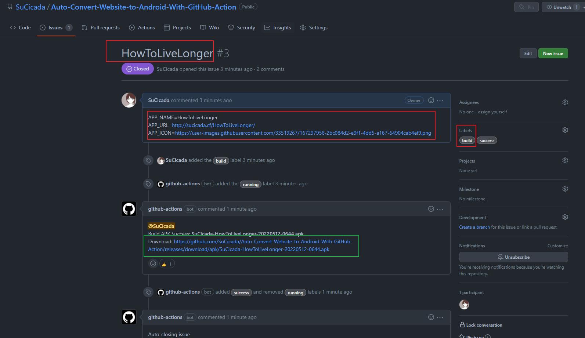

main program from https://github.com/SuCicada/website-to-android

## how to use:
1. create an issue
2. write follow  
   
    issue title is not important  
    issue template:  
    ```
    APP_NAME=
    APP_URL=
    APP_ICON=
    ```
    
    example:  
    ```properties
    APP_NAME=HowToLiveLonger
    APP_URL=http://sucicada.cf/HowToLiveLonger/
    APP_ICON=https://user-images.githubusercontent.com/33519267/167297958-2bc084d2-e9f1-4dd5-a167-64904cab4ef9.png
    ```
3. add label: **build** 
4. submit the issue !!
5. wait 2 minute. Then you can receive the download url from Action Bot.
6. play fun  



## todo 
- [ ] auto parse str of github uploading img  
      eg: ``
- [ ] github asset chinese not recognized [issues/19](https://github.com/SuCicada/test-github-action/issues/19)
- [ ] app name chinese garbled [issues/19](https://github.com/SuCicada/test-github-action/issues/19)
